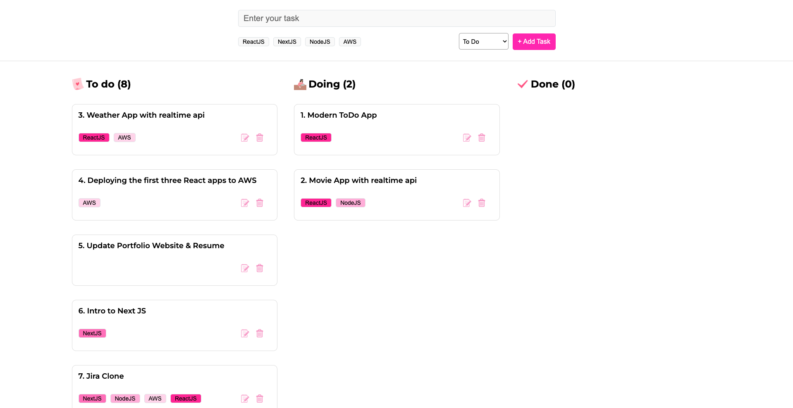

## Modern To-Do Application

This is a modern ToDo application with features such as:

- adding tasks
- adding tags to tasks
- being able to add each tasks to different status : "todo", "doing", "done"
- drag and drop tasks to different columns based on status
- total tasks count in each status
- task deletion
- edit tasks text & tags (working on)

# Preview of the Application

Live link - (will add shortly)

# React + Vite

This template provides a minimal setup to get React working in Vite with HMR and some ESLint rules.

Currently, two official plugins are available:

- [@vitejs/plugin-react](https://github.com/vitejs/vite-plugin-react/blob/main/packages/plugin-react/README.md) uses [Babel](https://babeljs.io/) for Fast Refresh
- [@vitejs/plugin-react-swc](https://github.com/vitejs/vite-plugin-react-swc) uses [SWC](https://swc.rs/) for Fast Refresh
